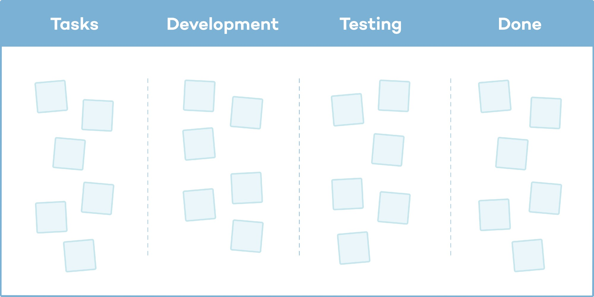
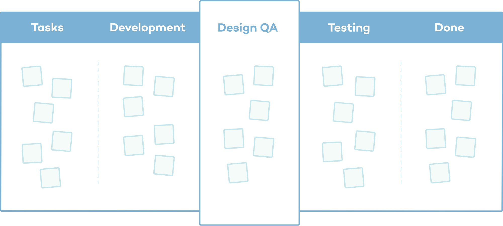

# Design QA: The Missing Link Between Design and Development

Design QA ensures that what gets built truly matches what was designed. It checks for accuracy in visuals, functionality, and user experience. By bridging the gap between design and development, it helps reduce design debt and leads to a more polished and trustworthy product. Making Design QA a formal part of the workflow improves quality without slowing the team down.

## **Have You Ever Launched a Feature That Looked Off?**

Maybe the padding felt tight. The button didn’t respond quite right. Or the layout just didn’t match the mockup. Individually, these issues may seem small. Together, they affect how users perceive the product. Over time, small visual or interaction flaws can make a product feel inconsistent or unfinished. This is where Design QA steps in.

### What is Design QA?

**Design QA, or Design Quality Assurance**, is the step where designers and QA engineers review a developed feature to make sure it matches the original design specifications. This happens after development is complete but before full QA testing begins.

It’s not just about verifying whether something works. It’s about making sure it looks and feels the way it was intended. It helps catch visual inconsistencies, spacing issues, interaction misalignments, and other UX concerns early in the process, keeping the product consistent and user-friendly.

### Why Does It Matter?

Great user experiences don’t happen by accident. They are the result of collaboration between design, development, QA, and product management. While much of the work happens behind the scenes, users interact directly with the visual and interactive layers of the product. If those elements feel off, users start to lose confidence.

It helps teams protect that experience. It ensures that the quality of implementation matches the quality of the design. It helps maintain consistency, builds trust, and ensures that small issues don’t turn into bigger problems after release.

### How Design QA Strengthens Your Product?

Even with well-documented specs, gaps often emerge during development, caused by tight deadlines, misunderstood requirements, or technical constraints. It acts as a safety net, allowing teams to:

- Review the coded UI before it moves to QA
- Collaborate with developers to resolve visual or interaction issues
- Ensure the implementation aligns with the intended user experience and visual design

This step is essential to delivering a polished, user-centered product and maintaining design integrity.

### Design QA Responsibilities

As part of Design QA responsibilities, designers and QA engineers work together to ensure the developed product aligns with the intended design. This collaborative review covers not just how the product functions, but also on how it looks and feels. By combining design insight with QA precision, teams can catch visual inconsistencies, UX issues, and alignment gaps early, before the feature reaches end users.

During Design QA, designers and QA engineers typically:

- Review the UI implementation in staging or test environments
- Compare the developed output with design specifications (such as Figma or Sketch files)
- Check critical design details including:
	- Spacing and alignment
	- Typography (font size, weight, color)
	- Interactions (hover states, transitions, click behavior)
	- Layout consistency across screens or components
- Provide developers with clear, specific, and actionable feedback
- Collaborate with developers to understand technical limitations and suggest alternative visual solutions if needed
- Re-verify changes to ensure fixes align with the original or updated design

This shared process helps create a consistent, polished user experience and reduces the chances of visual bugs slipping into production

### Example Scenario: Signup Form

Imagine your team just wrapped up development on a new signup form. It looks functional, the backend is solid, and it's ready to go live. But then, something feels off. You open the form and notice:

| Attribute       | Design Spec | Built Version                   | Result Without QA            |
|----------------|-------------|----------------------------------|------------------------------|
| Padding         | 16px        | 12px                             | Inconsistent spacing         |
| Border Radius   | 8px         | 6px (inputs), 10px (buttons)     | Broken visual consistency    |

**Without Design QA**, small design issues such as tight padding or uneven corners often go unnoticed. The form goes live, and while everything functions correctly, it just doesn’t look quite right. Users might not say anything, but they notice. Over time, these small design flaws can make the product feel unpolished and less trustworthy.

**With Design QA**, these issues are spotted early. The QA team notices the spacing and styling problems, works with designers and developers, and gets them fixed before launch. The final form not only functions well but also looks clean, consistent, and professional.

Design QA helps catch the small things, because in design, the small things make a big difference.

### Why Consistency Matters?

Consistency is a hallmark of good design. It builds user confidence, improves usability, and creates a seamless experience.

As a product grows and new features are added, small inconsistencies can begin to appear. Different button styles, varying padding, or slightly altered component behavior can sneak in. If these issues aren't addressed, they turn into what’s known as **design debt**. This is a buildup of visual and user experience misalignments that gradually weaken the overall product quality. Over time, the interface can start to feel unstructured and disconnected, even if every individual feature works correctly.

**For example**, one page might use rounded buttons while another uses square ones. A dropdown menu may behave slightly differently depending on where it's used. These details might seem minor at first, but when users start to notice that things don’t feel the same from one part of the product to another, it creates friction. It’s like walking through a house where every room has a slightly different floor height. Nothing is broken, but the experience feels inconsistent and less polished.

### What is Design Debt?

**Design debt** is the accumulation of design inconsistencies, shortcuts, and visual misalignments that grow over time, especially when teams prioritize speed over quality. Much like technical debt in code, it results from decisions made in the interest of fast delivery, without fully considering long-term design impact.

This debt can show up as:

- Misaligned UI elements  
- Inconsistent spacing and typography  
- Slightly different versions of similar components  
- A gradual drift from design system guidelines  

The more this debt builds up, the harder it becomes to maintain a clean, consistent, and trustworthy interface. It slows down future work, creates friction in the user experience, and erodes brand credibility.

### Common Challenges in Design QA

Even when teams are committed to delivering great user experiences, the Design QA process can still face its share of challenges. These challenges often stem not from individual oversight, but from broader team habits, priorities, or organizational culture. Here are some common issues that affect the effectiveness of Design QA:

#### Lack of design value awareness  
Some teams or companies may not fully understand or prioritize design. As long as a feature works functionally, visual quality may be overlooked. This leads to comments like, 
> “The feature works,” with no attention to how it looks or feels.

#### Inability to spot visual discrepancies  
Not everyone on the team can tell the difference between a refined design and a poorly implemented one. If a page "looks fine" to the untrained eye, important design gaps may go unnoticed. You might hear,
> “Looks good enough to me.”

These challenges can seem small at the moment, but over time, they lead to design debt, a buildup of inconsistencies that lowers the overall quality and trustworthiness of the product.

#### Speed over quality mindset  
In fast-paced environments, the pressure to ship features quickly can overshadow the need for visual consistency. Teams may skip Design QA altogether with reasoning like,   
> “We don’t have time for it.”

These challenges can seem small at the moment, but over time, they lead to **design debt**, a buildup of inconsistencies that lowers the overall quality and trustworthiness of the product.

### Speed vs. Quality

As product teams collaborate to deliver features, there’s a common risk of slipping into feature delivery mode, where the primary goal becomes closing tickets and shipping quickly.

In this rush, teams may lose sight of the bigger picture and overlook the finer details of design. The pressure to meet sprint deadlines can lead to compromises, where design integrity is sacrificed as a perceived “time-saving” measure.

While speed is important, consistently cutting corners on visual and interaction quality leads to a degraded user experience and increasing **design debt** over time.

### Design QA as Part of the Workflow

Building a great product means more than just writing code; it requires careful attention to how the product looks and feels to users. In most sprint-based teams, design work can surface at various stages of the development lifecycle. A typical workflow looks like this:

**Design → Development → QA → Release**

<em>Fig: Normal-Workflow</em>

In this flow, once development is marked complete, the responsibility of moving the ticket into testing often falls to the developer or product manager. While some teams attempt informal UI reviews, this approach is inconsistent.

Without a clearly defined step, **Design QA** is often skipped, either due to oversight or the assumption that the implementation is “good enough.”

### Why Make Design QA a Formal Step?

In fast-moving teams, it’s easy to assume that if something looks close enough, it’s good to go. But over time, these small visual compromises, missed alignments, inconsistent spacing, and off-brand elements accumulate. The result is a product that feels inconsistent, less polished, and harder to trust.
This is where a dedicated Design QA stage makes all the difference.
Making Design QA a formal step in your workflow:

Making Design QA a formal step in your workflow:

- Ensures visual reviews are intentional, not accidental
  Instead of relying on someone to “catch it if they notice,” it gives teams a clear checkpoint for reviewing the design implementation with focus and purpose.

- Gives designers space to verify and collaborate on the real thing
  It’s one thing to create in Figma, another to see it live in code. Design QA gives designers a chance to confirm their vision translates properly and to work with developers and QA when it doesn’t.

- Reinforces that design quality belongs to everyone
  Design QA isn’t just a designer’s job. By involving QA and developers, it becomes a shared responsibility. Everyone plays a part in making sure the product looks and feels right, not just works.

Adding this step doesn’t slow the team down; it prevents costly rework, design drift, and user frustration later. It’s a small investment in the process that pays off in product quality and team alignment.

### Updated Workflow with Design QA

**Design → Development → Design QA → QA → Release**

<em>Fig: Inclusion of Design QA in our Normal workflow</em>

Adding Design QA to the workflow may seem like a small step, but it can have a big impact. It helps **reinforce design integrity, improves consistency across features, and brings more clarity and transparency to the process**.

Some teams worry that adding Design QA might slow things down, but it actually does the opposite. It helps catch visual and UX issues early, before they turn into bigger problems or need time-consuming fixes after release. By identifying inconsistencies and alignment gaps upfront, teams reduce unnecessary back-and-forth, stay on the same page, and avoid building up **design debt**.

Rather than being an extra step that wastes time, Design QA acts as a safeguard. It ensures that the product is not just functional, but also polished and user-ready. It’s a small time investment that pays off in the long run with better efficiency and higher product quality.

**For example**: after developers finish working on a new signup form, the QA team reviews the UI in the staging environment. They check spacing, typography, interactions, and layout against the original design files. If something’s off, QA works closely with designers and developers to fix it, before moving on to functional testing. This way, visual and UX issues are addressed early, and the final product feels clean, consistent, and easy to use.

> *Sends a clear message: Design quality is not optional, it's essential*.

### Involving Developers in the Design Process

Design isn’t just something passed from one team to another, it’s a collaboration. Involving both developers and QA engineers early in the process helps uncover technical limitations, align expectations, and avoid last-minute surprises. This leads to smoother implementation, fewer design bugs, and a more cohesive product.
Just as designers play a key role during development, developers and QA add value during the design phase too. When developers understand the reasons behind design decisions, they pay closer attention to detail and build with the user in mind. QA can also provide early input to ensure the design is testable, consistent, and behaves as expected. Here’s what that collaboration can look like:

- **Talk through feature requirements early:**
  Designers, developers, and QA get on the same page about what’s being built and what challenges might come up.

- **Spot technical or edge case issues:**
  Developers can flag things that might be hard to build, and QA can point out situations that might break or confuse users.

- **Work together on early ideas:**
  Instead of designing alone, teams can sketch ideas together so they’re practical and testable.

- **Share designs as they evolve:**
  Designers can show progress and get feedback before things are final, helping avoid surprises later.

- **Stay aligned on design systems:**
  Everyone uses the same components and patterns, making development and testing smoother.

By working closely from the beginning, teams reduce confusion, speed up development, and build products that feel polished and user-friendly.

When developers understand the why behind design decisions, they build with greater precision and empathy for the user experience.

### Final Thoughts

Most challenges in product design and development can be overcome through mutual respect, open communication, and honesty. Design QA goes beyond achieving perfect visuals, it ensures the delivery of thoughtful, consistent, and high-quality experiences that truly reflect the brand and build user trust.

Designers rely on Design QA to bring their vision to life as intended. Developers benefit from early identification of technical challenges, keeping the user experience at the forefront. Meanwhile, QA engineers play a vital role in verifying that the product functions smoothly and aligns with design expectations before release. 

When teams communicate openly, respect each other’s expertise, and share responsibility, they can work together effectively to create products that meet both business objectives and user needs.

*Make Design QA part of your workflow. Make it matter.*

*Happy testing!!*

