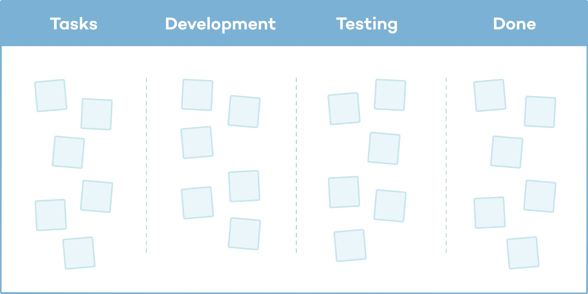
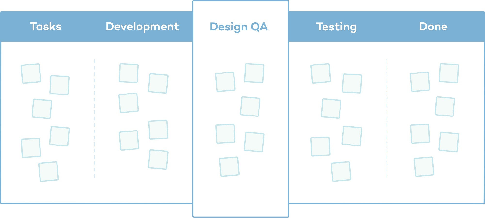

# The Importance of Design QA in Product Design

Ever launched a feature only to realize the padding is off, the layout feels cramped, or the button just feels wrong? These small issues may seem insignificant, but they chip away at user trust. That’s where **Design QA** comes in, it ensures that the product your team builds matches the vision your designers crafted.

Great customer experiences don’t happen by accident. In product design, customer experience is shaped by the combined efforts of design, development, QA, DevOps, and product management. Among these, design and UX are often the most visible components of how users perceive a product.

Design QA bridges the gap between design intent and implementation, safeguarding consistency, polish, and user trust.

### What is Design QA?

**Design QA** (Quality Assurance) is a dedicated step in the product workflow where designers review a developed feature to ensure it aligns with the original design specifications. It typically happens after development but before QA testing.

Even with detailed specs, discrepancies often arise due to time constraints, technical limitations, or miscommunication. As a result, what gets built may not fully reflect the designer’s original vision. Design QA helps bridge this gap by allowing designers to:

- Review the coded UI before it moves to QA
- Collaborate with developers to resolve visual or interaction issues
- Ensure the implementation aligns with the intended user experience and visual design

This step is essential to delivering a polished, user-centered product and maintaining design integrity.

### Design QA Responsibilities

During Design QA, designers:

- Review the UI in staging environments
- Compare the output with design specifications (e.g., Figma files)  
- Verify key visual and interaction elements such as:
  	- Spacing  
  	- Typography  
  	- Layout consistency  
  	- Interactive behaviors  
- Provide developers with clear, actionable feedback
- Collaborate with developers to:
   	- Identify technical constraints
	- Suggest visual alternatives when needed

### Example: Signup Form

**Scenario:**  
A signup form is designed and developed.

| Attribute       | Design Spec | Built Version                   | Result Without QA            |
|----------------|-------------|----------------------------------|------------------------------|
| Padding         | 16px        | 12px                             | Inconsistent spacing         |
| Border Radius   | 8px         | 6px (inputs), 10px (buttons)     | Broken visual consistency    |

**Without Design QA**:  
These inconsistencies may make it to production. Users might not be able to articulate what's wrong, but they feel it. Over time, it harms brand perception and user trust.

**With Design QA**:  
Designers catch the issues early, collaborate with developers to correct them, and ensure a polished, consistent user experience before release.

### Why Consistency Matters

Consistency is a hallmark of good design. It builds user confidence, improves usability, and creates a seamless experience.

As a product evolves, however, small inconsistencies inevitably creep in. Left unchecked, these incremental changes build up into what’s known as design debt: a growing collection of visual and UX misalignments that erode the integrity of the experience, making the product feel disjointed and patchwork over time.

### What is Design Debt?

Design debt is the accumulation of design inconsistencies, shortcuts, and visual misalignments that grow over time — especially when teams prioritize speed over quality. Much like technical debt in code, it results from decisions made in the interest of fast delivery, without fully considering long-term design impact.

This debt can show up as:

- Misaligned UI elements  
- Inconsistent spacing and typography  
- Slightly different versions of similar components  
- A gradual drift from design system guidelines  

The more this debt builds up, the harder it becomes to maintain a clean, consistent, and trustworthy interface. It slows down future work, creates friction in the user experience, and erodes brand credibility.

### Common Challenges in Design QA

Design QA often faces challenges rooted in deeper team or organizational mindsets:

#### Lack of design value awareness  
Teams or companies may not fully understand or prioritize design, leading to the absence of processes that support high-quality visual outcomes.  
> “The feature works.”

#### Inability to spot visual discrepancies  
Many stakeholders can’t distinguish between a polished design and a poorly implemented version.  
> “Looks good enough to me.”

#### Speed over quality mindset  
Teams prioritize rapid delivery of features, often at the cost of visual consistency and refinement.  
> “We don’t have time for it.”

These challenges contribute to design debt and erode the overall quality and trustworthiness of the product over time.

### Speed vs. Quality

As product teams collaborate to deliver features, there’s a common risk of slipping into feature delivery mode, where the primary goal becomes closing tickets and shipping quickly.

In this rush, teams may lose sight of the bigger picture and overlook the finer details of design. The pressure to meet sprint deadlines can lead to compromises, where design integrity is sacrificed as a perceived “time-saving” measure.

While speed is important, consistently cutting corners on visual and interaction quality leads to a degraded user experience and increasing design debt over time.

### Design QA as Part of the Workflow

In most sprint-based teams, design work can surface at various stages of the development lifecycle. A typical workflow looks like this:

Design → Development → QA → Release

<em>Fig: Normal-Workflow</em>

In this flow, once development is marked complete, the responsibility of moving the ticket into testing often falls to the developer or sometimes the product manager. While some teams attempt informal UI reviews, this approach is inconsistent.

Without a clearly defined step, Design QA is often skipped, either due to oversight or the assumption that the implementation is “good enough.”

This raises an important question:

*If accurate design implementation is important, why not make it an explicit step?*

### Why Make Design QA a Formal Step?

By adding Design QA as a dedicated stage, teams can:

- Ensure visual reviews aren’t missed  
- Give designers a chance to verify and collaborate on the final output  
- Reinforce that design quality is a shared responsibility  

### Updated Workflow with Design QA

Design → Development → Design QA → QA → Release

<em>Fig: Design-QA-Workflow</em>

This small change can make a big impact:

- Reinforces design integrity  
- Improves consistency across features  
- Adds clarity and transparency to the process  

> *Sends a clear message: Design quality is not optional, it's essential*.

### Involving Developers in the Design Process

Just as designers are essential during implementation, involving developers early and throughout the design process is equally crucial. This collaboration enables teams to:

- Discuss feature requirements upfront to identify technical constraints or opportunities.
- Collaborate on initial concepts to brainstorm design solutions.
- Share design iterations to gather developer feedback throughout the process to ensure feasibility and clarity.
- Educate and synchronize around design tokens, components, and standards.

When developers understand the why behind design decisions, they build with greater precision and empathy for the user experience.

### Conclusion

Most challenges in product design and development can be solved with mutual respect, communication, and honesty.

Design QA isn’t about pixel perfection. It’s about delivering thoughtful, consistent, high-quality experiences that:

- Reflect well on your brand  
- Build trust with your users  

*Make Design QA part of your workflow. Make it matter.*

*Happy testing!!*

