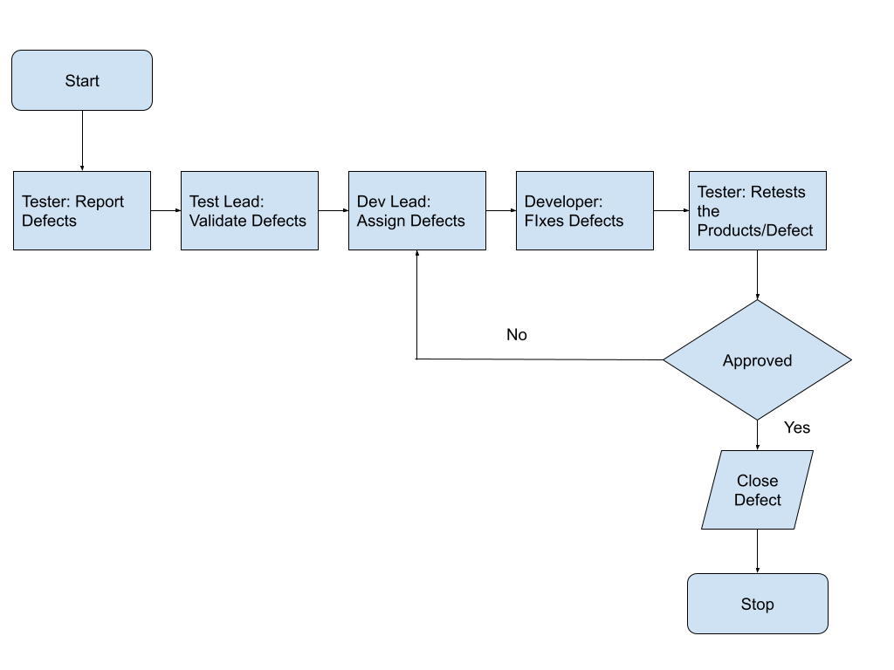

# Sample Test Plan

## **Project Name**
 
### **Test Plan Document**

| Date       | Version | Author      | Reviewed By   | Revised Date |
|------------|---------|-------------|---------------|--------------|
| MM-DD-YYYY | x.x.x   | QA Engineer | Product Owner | MM-DD-YYYY   |

### Table of Contents

1. [About Document](#about-document)  
2. [Scope of Test](#scope-of-test)  
3. [Features to be Tested](#features-to-be-tested)  
4. [Assumptions, Suspensions, and Resumptions](#assumptions-suspensions-and-resumptions)  
5. [Project Management Tool](#project-management-tool)  
6. [Test Management Tool](#test-management-tool)  
7. [Test Environment](#test-environment)  
8. [Tools Used](#tools-used)  
9. [Preliminary Action before Sprint](#preliminary-action-before-sprint)  
10. [Test to Perform](#test-to-perform)  
11. [Issue Logging (Defect Tracking and Reporting)](#issue-logging-defect-tracking-and-reporting)  
12. [Defect Severity](#defect-severity)  
13. [Bug Reporting Template](#bug-reporting-template)  
14. [JIRA Task Template](#jira-task-template)  
15. [Test Completeness](#test-completeness)  
16. [Test Deliverables](#test-deliverables)  
17. [Before Testing Phase](#before-testing-phase)  
18. [During the Testing](#during-the-testing)  
19. [After the Testing Cycle is Over](#after-the-testing-cycle-is-over)  
20. [Test Process](#test-process)  
21. [Roles and Responsibilities](#roles-and-responsibilities)  
22. [Risks, Issues, and Dependencies](#risks-issues-and-dependencies)  
23. [List of Approvals](#list-of-approvals)  
24. [Terms/Acronyms](#termsacronyms)  

### **About document**

The document highlights the Quality Assurance process implemented for the Audit app of the Sunseeker hotel network. Once we plan for future releases, the test plan will be updated accordingly.

### **Scope of test**

Test Scenarios/Test Objectives that will be validated. Clear picture for what we are going to cover (Example: Functional Test, Non-functional Test, etc).

### **Features to be tested**

After the Sprint planning, the QA team will prepare all the required test data, Automated scripts, for the feature to be tested in the sprint.

### **Assumptions, Suspensions, and Resumptions**

Sunseeker app will work on the attached link browser description. Browser compatibility is the most important at least the web application supports the below-mentioned browser.  
**Browser Support**: Chrome, Firefox, Safari, and Internet Explorer   
**Responsiveness**: Mobile Responsiveness

### **Project Management Tool**

- JIRA for the Sprint cycle management
- Confluence for the track of the documents
- Figma for the Design

### **Test Management Tool**

- JIRA for Bug/Defect Tracking
- Confluence to track the documents
- Google spreadsheet to handle the SOW (One pager).
- Google document to handle the Release notes, Diagnosis Report, etc.

### **Test Environment**

- Web application (Chrome / Firefox / Safari)
- Development
- Android Smartphones for the Test in Android
- iPhone for the Mobile app test in the IOS
- Android Studio
- Virtual Machine for the Device compatibility

### **Tools Used**

- Appium for Mobile App Testing
- JMeter for Non-functional Test
- Postman for the APIs testing
- Cypress for end to end Web app testing

### **Preliminary Action needs to be taken before Sprint**

Before starting the Sprint all the team members should sit and have a Backlog Grooming session. By doing this Project Manager will communicate about the task to all the team members so that the QA team can fill all the Acceptance Criteria and the Definition of Done to the Description of the Task on JIRA.

### **Test to Perform**

- Design mockup UI test.
- Perform the test case document.
- Review the test plan document.
- Branch-wise Feature test on the Development Environment (Server).
- Integrated Functional test on the QA Environment (Server) and use the tools for the better test report.
- Prepare the Test Coverage Report.
- Prepare a Release note and the Sprint User Manual.

### **Issue Logging (Defect Tracking and Reporting)**

Issues will be logged using JIRA and depending upon the severity, the issue will be tracked in the backlog or assigned to the developer in the current sprint.

<em>Fig: Defect tracking and Reporting workflow</em>

### **Defect Severity**

Defect found during the Testing will be categorized according to the bug-reporting tool and the Categories are:

| Severity         | Impact                                                                                                                                                                                                                                                        |
| ---------------- | ------------------------------------------------------------------------------------------------------------------------------------------------------------------------------------------------------------------------------------------------------------- |
| **1 (Critical)** | - This bug is critical enough to crash the system, cause file corruption, or potential data loss - It causes an abnormal return to the OS (crash or failure message appears)   - It causes the application to hang and requires rebooting the system \| |
| **2 (High)**     | - It causes a lack of vital program functionality, but there is a workaround                                                                                                                                                                                  |
| **3 (Medium)**   | - Degrades system quality, but there is a workaround (e.g., through another screen) - Prevents testing of some areas, but others can be tested independently                                                                                               |
| **4 (Low)**      | - Insufficient or unclear error message with minimal impact on use                                                                                                                                                                                            |
| **5 (Cosmetic)** | - Insufficient or unclear error message with no impact on use                                                                                                                                                                                                 |

### **Bug Reporting Template**

  
For the Bug Reporting Template Please follow the below-mentioned [link](https://docs.google.com/document/d/1Dnohx3NVnYApA9XNPiAE_CVG9sMFB2QK3H3piSpT5kc/edit).

### **JIRA Task Template**

For the Task filing template please follow the below-mentioned [link](https://docs.google.com/document/d/1YpKUTu3YFFgVi_w2hWf1qC28DNDxgA5Lmu57y8Rsza0/edit).

### **Test Completeness**

A few criteria to check Test Completeness would be

- 100% test coverage.
- All manual test cases will be executed.
- All open bugs are fixed or will be fixed in the next release.
- Fulfillment of the Acceptance Criteria.
- The feature must incorporate the client feedback while releasing the feature.
- In case of no bug, the team must have a discussion and close that ticket.

### **Test Deliverables**

Test deliverables are provided as below:

### **Before Testing Phase**

- Preparation of the Test Plan document.
- Preliminary preparation of the Test Case document.
- Review the Acceptance Criteria.

### **During the Testing**

- Gather the Test Data
- Complete the Test Case document
- Move JIRA tickets to the done

### **After the testing cycle is over**

- Test Results/Report
- Defect Report /Diagnostic Report
- Prepare a user manual for the release
- Installation guide / Deployment Instruction (if needed)
- Prepare a Release note.

### **Test Process**

  
Testing must be planned and it requires discipline to act upon it. The quality and effectiveness of software testing are primarily determined by the quality of the test processes used.  
The activities of testing can be divided into the following basic steps:

- Planning and control
- Analysis and Design
- Implementation and Execution
- Evaluating exit criteria and Reporting
- Test Closure Activities

Please follow the below attached [link](https://www.toolsqa.com/software-testing/test-process-in-software-testing/) for a better understanding.

### **Roles and Responsibilities**

<table border="1" id="bkmrk-s.n.-roles-responsib" style="border-collapse: collapse; width: 100%;"><tbody><tr><td style="width: 25%;">S.N.</td><td style="width: 25%;">Roles</td><td style="width: 31.4198%;">Responsibilities</td><td style="width: 18.5802%;">Remarks</td></tr><tr><td style="width: 25%;">1</td><td style="width: 25%;">Quality Assurance Engineer</td><td style="width: 31.4198%;">- Manual Testing
- Automation Testing
- Non Functional Test
- API Tests
- Preparation of all the documents and reports.

</td><td style="width: 18.5802%;"> </td></tr></tbody></table>

### **Risks, Issues, and Dependencies**

The team will perform a short triage meeting where they discuss the severity of the defects/bug and prioritize accordingly. The team should work on assigning the bug to the developer without being hampered in the sprint cycle.  
Please go to the Section Defect tracking and reporting section.

### **List of Approvals**

A list of the team members will approve the documents

| S.N. | Name | Role            |
|------|------|-----------------|
| 1    |      | Product Owner   |
| 2    |      | Development Lead|

### **Terms/Acronyms**
  
List of the Acronyms mostly used in the project.

| Term/Acronym | Definition/Full Form                 |
|--------------|--------------------------------------|
| UAT          | User Acceptance Test/ing             |
| API          | Application Program Interface        |
| TDD          | Test-Driven Development              |
| BDD          | Behavior Driven Development          |
| UI           | User Interface                       |
| UX           | User Experience                      |
| MVP          | Minimum Viable Product               |
| SOW          | Statement of Work                    |
| E2E Test     | End to End Test                      |
| B2B          | Business to Business                 |
| B2C          | Business to Customer/Consumer        |
